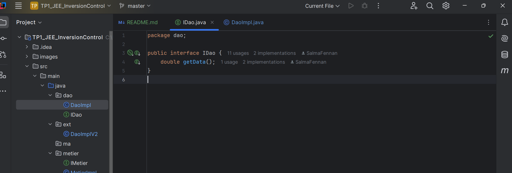

<h2>TP1 JEE Inversion de control et injection des dépendances</h2>
<h3>Objectif</h3>
  
L'objectif est de comprendre et d'implémenter l'injection de dépendances en utilisant :

    <ul>
        <li>Instanciation statique</li>
        <li>Instanciation dynamique</li>
        <li>Spring (XML & Annotations)</li>
    </ul>
<h2>1. Création de l'interface IDao</h2>

<h2>2. Implémentation de IDao</h2>

 <h2>3. Création de l'interface IMetier</h2>

<h2>4. Implémentation de IMetier</h2>

 <h2>5. Injection des Dépendances</h2>
    <h3>Par Instanciation Statique</h3>

    <h3>Par Instanciation Dynamique</h3>

    <h3>Avec Spring (XML)</h3>

 <h3>Avec Spring (Annotations)</h3>

 <h3>Le fichier pom.xml</h3>

 <h3>Le fichier config.txt</h3>

 <h3>Le diagramme de classe</h3>

